## 실시간 호텔 예약, 결제 웹 서비스 
> 관리자가 업로드한 상품을 날짜를 선택하여 구매하는 웹 서비스 구현
> 로그인/회원가입, 토스페이먼츠 연동 결제, 실시간 예약에 따른 재고 차감, 데이터베이스 기록 기능 구현

---

##  기술 스택

| 분야 | 기술 |
|------|------|
| 서버 | Node.js + Express |
| 템플릿 | EJS |
| 데이터 실시간 반영 | Socket.IO |
| DB | MySQL + Sequelize ORM |
| 인증 | Passport + JWT + express-session |
| 결제 | 토스페이먼츠 API |

---

## 주요 기능

| 기능 | 설명 |
|------|------|
|  **회원가입/로그인** | passport-local: 회원가입 passport-jwt: 권한 인증 |
|  **실시간 재고 관리** | socket.io를 통한 재고 변경 신호 송수신 |
|  **결제** | 토스 페이먼츠 API 결제 요청 및 인증 |
|  **예약** | 상품 선택 후 예약 생성, 사용자 마이페이지에서 조회 및 취소 가능 |
|  **결제 상태 관리** | PENDING → CONFIRMED / CANCELED 상태 흐름 관리 및 실패 시 롤백 처리 |
|  **결제 확인 스케줄러** | 일정 주기로 결제DB 확인해 진행되지 않은 결제는 자동 실패 처리 |
|  **관리자 페이지** | 결제상황, 예약 상황, 재고 확인 전용 페이지 구현 |

---

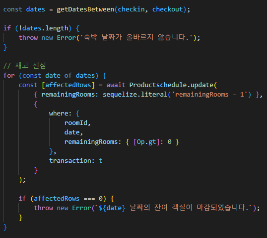
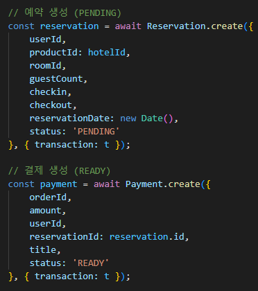
- 결제창 진입 시, 재고를 선점한 후 가예약 상태로 DB에 기록 (sequelize.transaction으로 LOCK 처리)
- 에러 발생 시 즉시 재고 복구 로직 실행

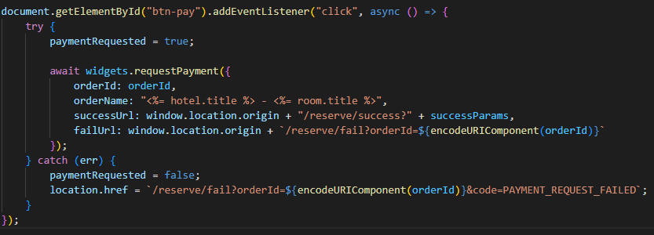
- 결제 버튼을 누르면 tosspayments API를 통해 결제 요청

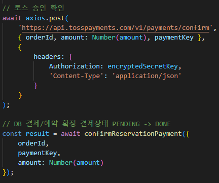
- axios 요청을 통해 결제 승인을 확인

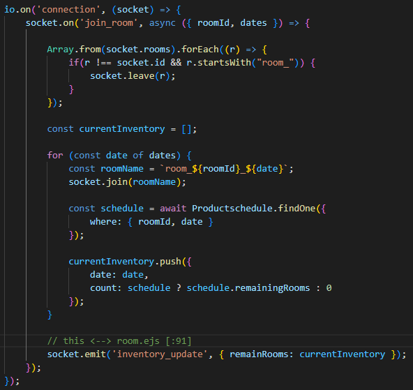
- 사용자가 객실 선택 후, 날짜를 선택하면 해당 데이터(roomId, dates)로 socket.on 실행
- DB조회를 통해 잔여 재고를 확인 후 다시 emit으로 전달
- 웹 페이지에 잔고량 알림

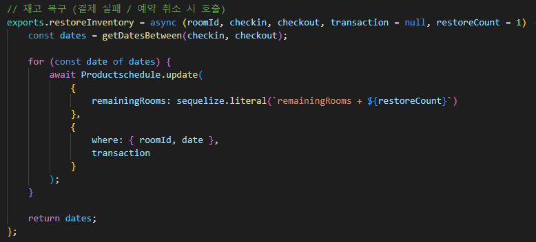
- 결제 실패 혹은 취소 시 호출
- 저장 안정성을 위해 sequelize.literal을 통해 DB 즉시 반영

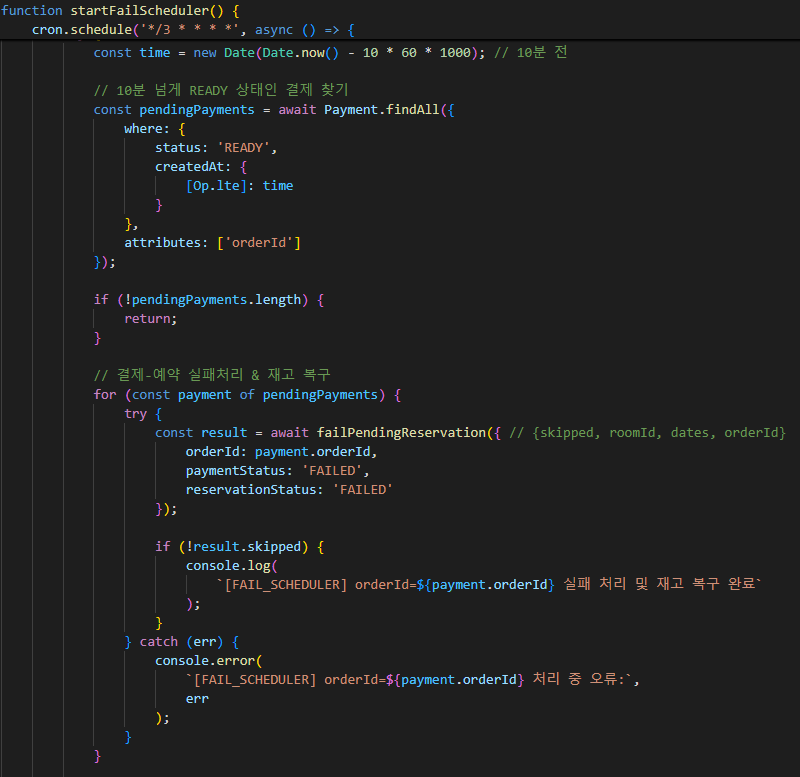
- app.js 실행 시 호출
- node-cron 모듈을 통해 주기적으로 실행
- 10분 이상 READY 상태인 결제데이터를 한꺼번에 찾아 재고 복구 실행

---

## 상세 화면 이미지

| 메인 화면 | 로그인 화면 | 마이페이지 |
|-----------|-------------|-------------|
| 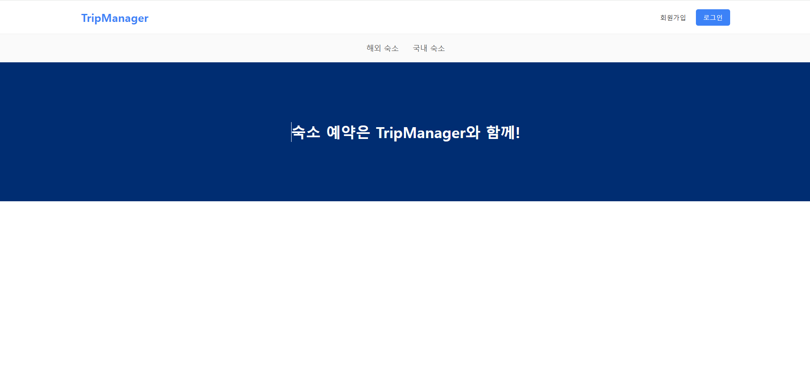 | 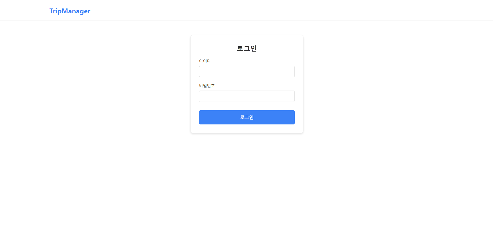 | 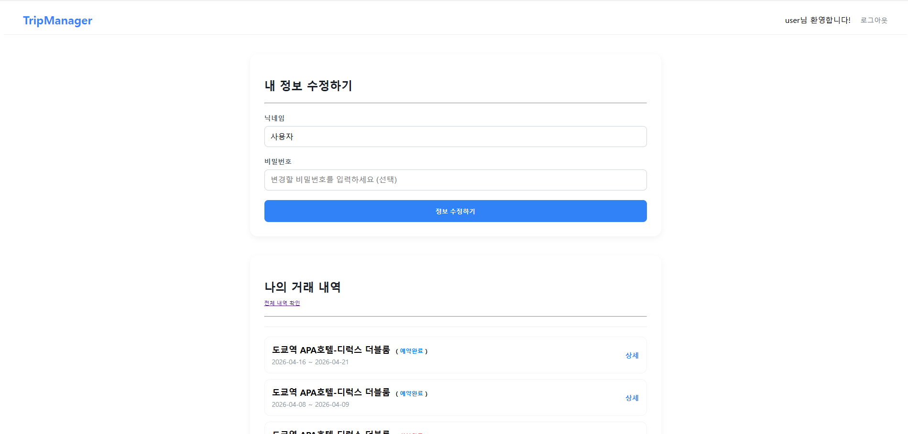 |

| 숙소 선택 화면 | 객실 선택 화면 | 날짜 선택 화면 |
|----------------|--------------|--------------|
| 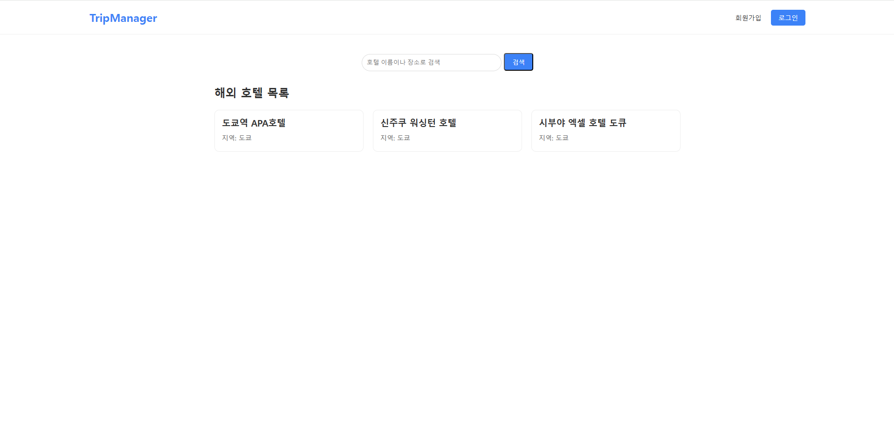 | 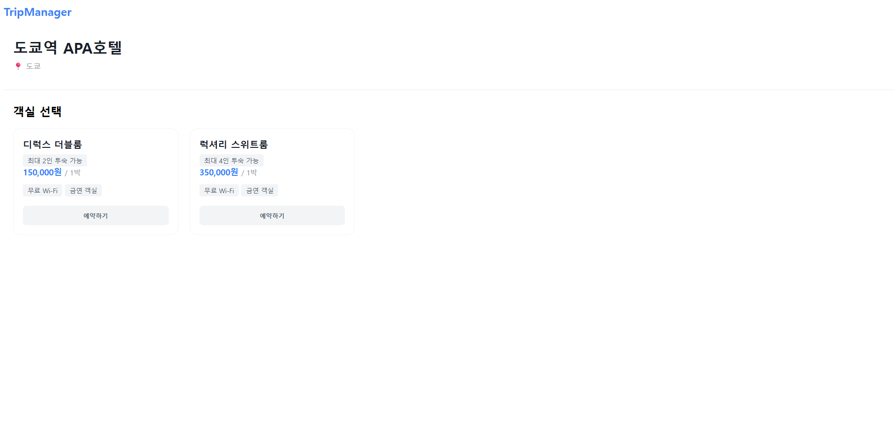 | 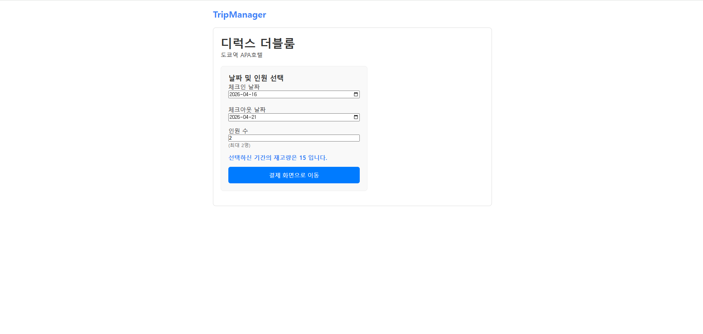 |

| 결제 화면 | 결제 성공 화면 | 예약 내역 화면 |
|----------------|--------------|--------------|
| 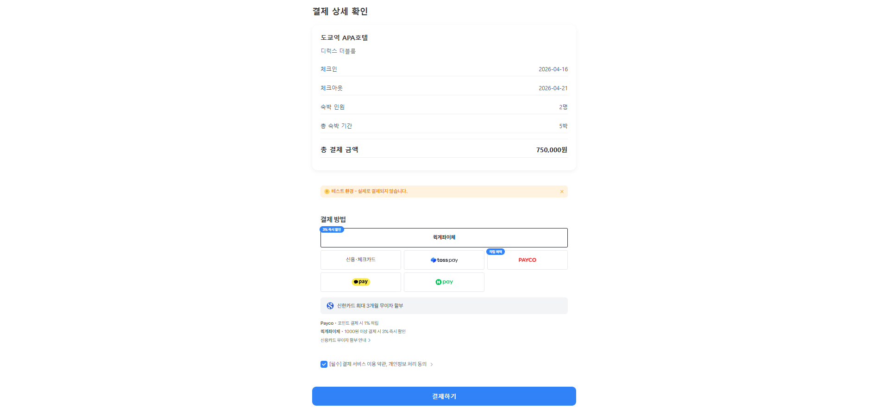 | 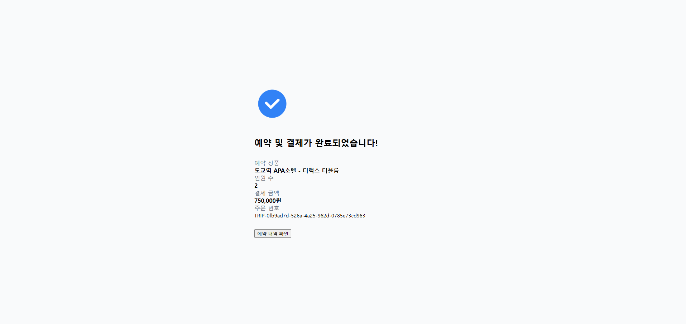 | 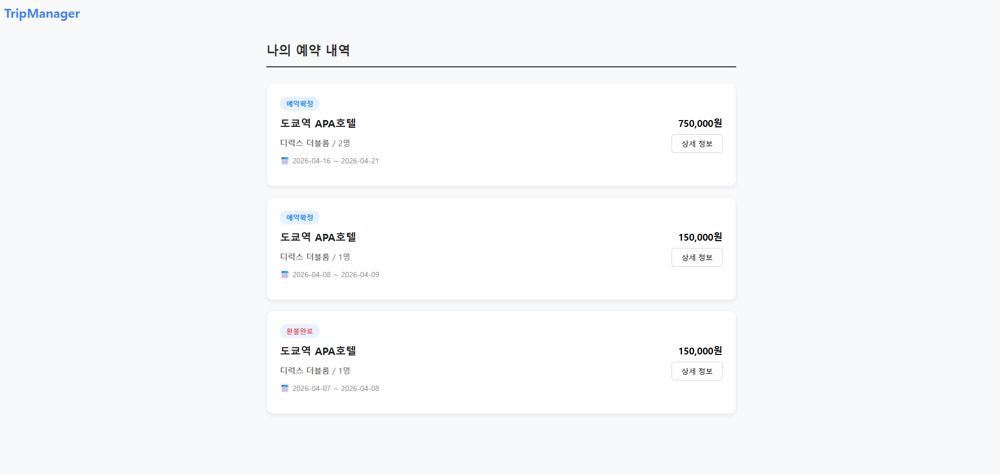 |

| 상세 결제 정보 화면  |
|----------------|
| 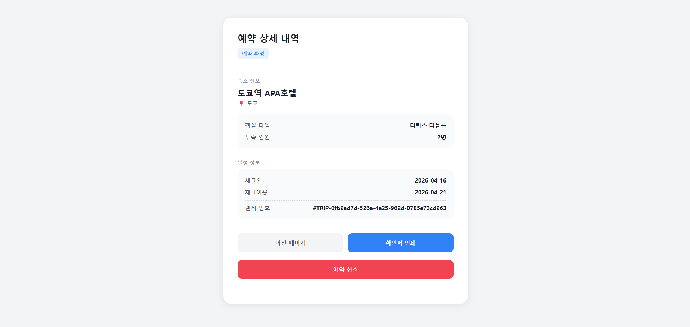 |
